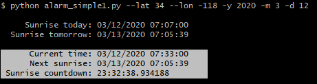
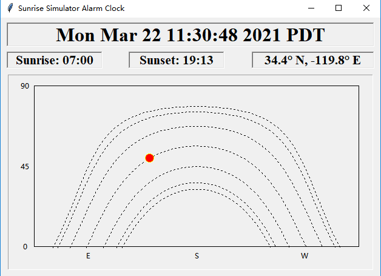
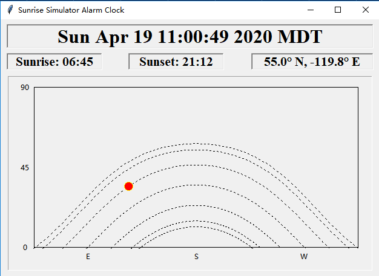
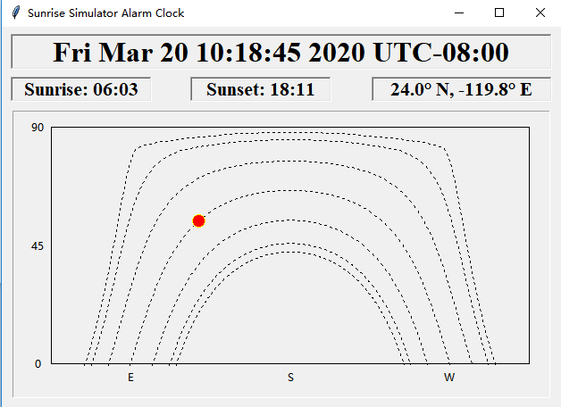

# Sunrise Simulator Alarm Clock

There are 2 Python programs:

- alarm\_simple1.py: a terminal program simulates a digital clock for 1 day and shows sunrise time

- tk\_clock.py: a GUI program which shows sunrise, sunset time and simulates the Sun's position

## Install

Python librarys listed below must be installed:

```shell
pip3 install pytz
pip3 install julian
pip3 install timezonefinder
```
If your system doesn't have Python tinker, you must also install it, for example:

```shell
sudo apt-get install python3-tk
```
## Usage

### alarm\_simple1.py

This is a pure command line program. Use -h argument to print the help message:

```shell
$ python alarm_simple1.py -h
usage: alarm_simple1.py [-h] [-y YEAR] [-m MONTH] [-d DAY] [--lat LAT]
                        [--lon LON]

Sunrise simulator alarm clock.

optional arguments:
  -h, --help            show this help message and exit
  -y YEAR, --year YEAR  year of date
  -m MONTH, --month MONTH
                        month of date (1-12)
  -d DAY, --day DAY     day of date (1-31)
  --lat LAT             observer latitude (-65.7-65.7)
  --lon LON             observer longitude (-180.0-180.0)
```

For example, we choose to simulate Mar 12th, 2020 in Los Angeles:

```shell
$ python alarm_simple1.py --lat 34 --lon -118 -y 2020 -m 3 -d 12

     Sunrise today: 03/12/2020 07:07:00
  Sunrise tomorrow: 03/13/2020 07:05:39

      Current time: 03/12/2020 06:14:00
      Next sunrise: 03/12/2020 07:07:00
 Sunrise countdown: 0:53:00.000012
```

The program updates `Current time` roughly 25 times per second (25 ticks per second), and add 1 minutein every tick, so the simulation is about 1500x fast forward to a real clock.

The program can derive the correct time zone from the geolocation provided, thanks to Python library `timezonefinder`.

When the `Current time` is after sunrise time, the last 3 lines will be displayed in reverse video mode:



The default parameters for the simulation are Mar 9th, 2020, 34.4N, -119.8E (UCSB).

Since the existence of polar day and polar night (no sunrise or sunset in these days) inside polar circle, we have to limit the latitude to (-65.7, 65.7). That range is a little bit narrower than non-polar zone (-66.56, 66.56), because the program will crash near polar circle for summer solstice, we believe the reason is that: even though there is a sunrise, but the time of the sunrise is so early that it is BEFORE the 00:00, and our algorithm cannot handle this case. We don't have enough time to debug this.

### tk\_clock.py

This is an Python GUI program. Use -h argument to print the help message:

```shell
$ python tk_clock.py -h
usage: tk_clock.py [-h] [-y YEAR] [-m MONTH] [-d DAY] [--days DAYS]
                   [--int INT] [--lat LAT] [--lon LON]

Sunrise simulator alarm clock for latitude 24N - 55N.

optional arguments:
  -h, --help            show this help message and exit
  -y YEAR, --year YEAR  year of start date (1900-2100)
  -m MONTH, --month MONTH
                        month of start date (1-12)
  -d DAY, --day DAY     day of start date (1-31)
  --days DAYS           number of days to simulate (1-365)
  --int INT             number of days between each simulating days (1-365)
  --lat LAT             observer latitude (24-55)
  --lon LON             observer longitude (-180.0-180.0)
```

The default parameters for the simulation are:

 - start date: Dec 21th, 2019

 - number of days to simulate: 7

 - interval between eatch simulating days: 30 days

 - observer location: 34.4N, -119.8E (UCSB).

For example, we choose to start at Dec 22th, 2020:

```shell
$ python tk_clock.py -y 2020 -m 12 -d 22
```

We will get something like below:



The simulation runs a tick every 80 microseconds and 15 minutes will be added for each tick, so roughly the animation is 11250x fast forward.

Since the scales of the X (azimuth) and Y (altitude) are fixed, we have to limit the obsever latitude to (24N, 55N) to make the sun position track contained inside the graph.

The observer is at latitude 55N:



The observer is at latitude 24N:



Actually if a northern hemisphere observer is at an latitude lower than 23.44N (Tropic of Cancer), he will notice that the Sun's azimuth points to north at some summer day noons. 

## Design

### Requirment

Since there is only one sunrise per day, using real system clock is not practical. So we decide to make a fast clock simulator which will simulate a day in less a minute.

### Algorithm

We developed the sunrise Python algorithm according to the Wikipedia Sunrise equation page:

[Sunrise equation - Wikipedia](https://en.wikipedia.org/wiki/Sunrise_equation)

To plot the Sun position we need to convert the ecliptic coordinates to horizontal coordinates: 

[Ecliptic coordinate system - Widipedia](https://en.wikipedia.org/wiki/Ecliptic_coordinate_system)


### Reference

The spreadsheets of NOAA (National Oceanic and Atmospheric Administration) Solar Calculator page can be used to calculate solar data for a day or a year at a specified site, we use it to verify our algorithm:

[NOAA Solar Calculator](https://www.esrl.noaa.gov/gmd/grad/solcalc/calcdetails.html)

### Time zone

To show the sunrise time in local time, we need to find the correct time zone from the geolocation of the observer. We use timezonefinder and pytz to achive this:

- [timezonefinder](https://pypi.org/project/timezonefinder/)

- [pytz](https://pypi.org/project/pytz/)

### User Interface

#### Terminal Interface

如果用普通的 print, 每秒钟显示一行，则会造成屏幕上大量的输出，很难看。


[ANSI escape code - Wikipedia](https://en.wikipedia.org/wiki/ANSI_escape_code)


#### GUI
用 Python 的 Tk 库 tkinter 似乎也不难, 比如下面这个数字时钟的例子: 

[Python tkinter digital clock with little style](https://www.sourcecodester.com/tutorials/python/11402/python-simple-digital-clock.html)

tkinter 缺少一个自带的日期时间控件, 可能可以用这个:

[tkcalendar 的 DateEntry](https://tkcalendar.readthedocs.io/en/stable/DateEntry.html)

## Debug

